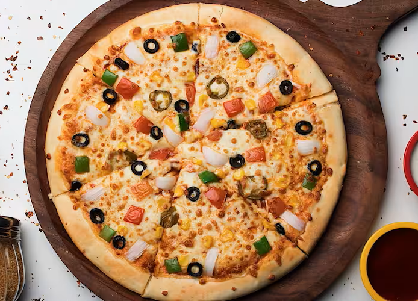
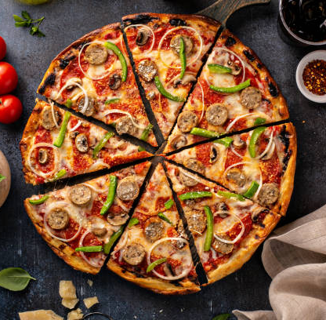
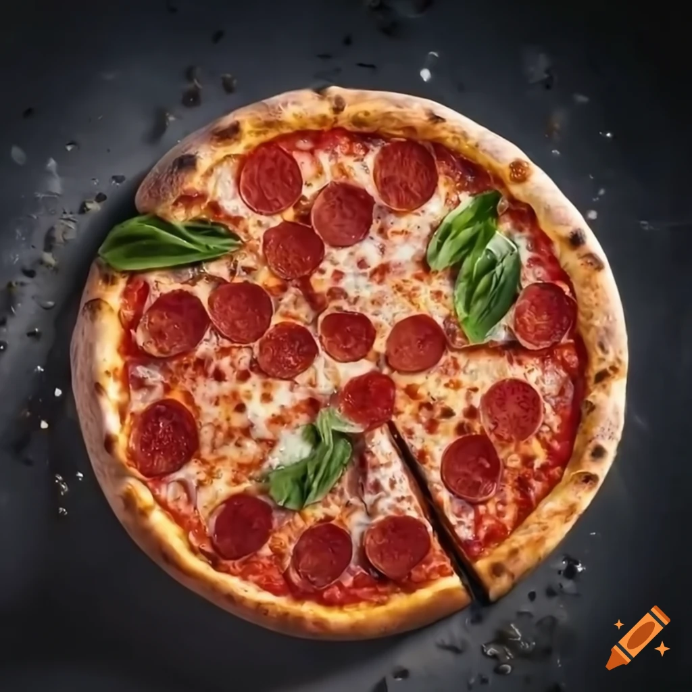
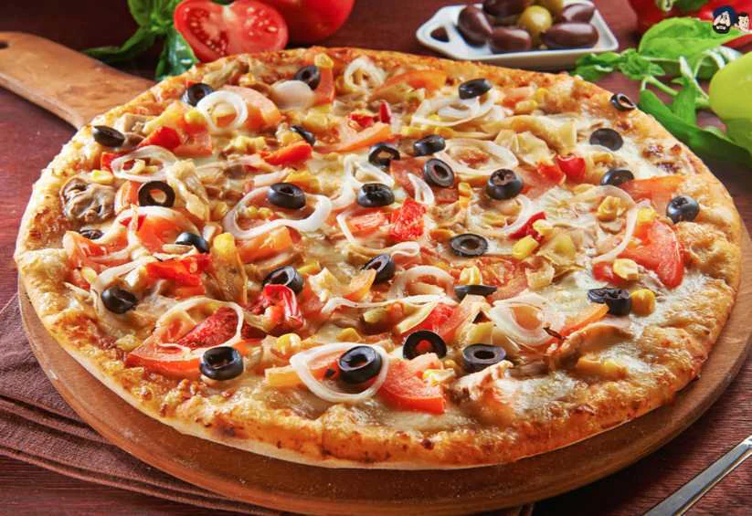
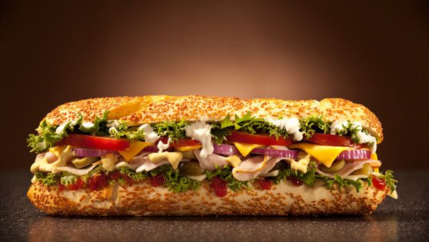

# Smart Pizza Corner

HTML, CSS, & Javascript

**head**

```
<head>
    <link rel="stylesheet" href="style.css">
    <link rel="shortcut icon" href="images/logo1.png" type="image/x-icon">
    <link rel="stylesheet" href="https://cdnjs.cloudflare.com/ajax/libs/font-awesome/6.7.2/css/all.min.css">
    <meta charset="UTF-8">
    <meta name="viewport" content="width=device-width, initial-scale=1.0">
    <title>Smart Pizza Corner | Home </title>

    <!-- Bootstrap CSS -->
    <link href="https://cdn.jsdelivr.net/npm/bootstrap@5.3.1/dist/css/bootstrap.min.css" rel="stylesheet" integrity="sha384-2V2UFtLxAOK1Dbn4+ZsuKGoHzDAp6NlIW/e7M8b7C3Zsl7cReWg9u79FTD4ckkdN" crossorigin="anonymous">

    <!-- Font Awesome for Icons -->
    <link href="https://cdnjs.cloudflare.com/ajax/libs/font-awesome/6.5.0/css/all.min.css" rel="stylesheet">

    <!-- Google Fonts -->
    <link href="https://fonts.googleapis.com/css2?family=Roboto:wght@400;700&display=swap" rel="stylesheet">

    

</head>
  
```

**Header**

```
 <header>
    <div class="header">
        
        <div class="headerbar">
            <div class="account">
                <ul>
                    <a href="index.html" >
                        <li>
                            <i class="fa-solid fa-house-chimney">  
                            </i>
                        </li>
                    </a>
                    <a href="#">
                        <li>
                            <i class="fa-solid fa-magnifying-glass searchicon" id="searchicon1"></i>
                        </li>
                    </a>
                    <div class="search" id="searchinput1">
                        <input type="search">
                        <i class="fa-solid fa-magnifying-glass srchicon"></i>
                    </div>
                    <a href="sign-in.html" >
                        <li>
                            <i class="fa-solid fa-user" id="user-mb"></i>
                        </li>
                    </a>
                </ul>
            </div> 
            <div class="nav">
                <ul>
                    <li>
                        <a href="index.html">Home</a>
                    </li>
                    <li>
                        <a href="menu.html">Menu</a>
                    </li>
                    <li>
                        <a href="order.html">Order</a>
                    </li>
                    <li>
                        <a href="about.html">About</a>
                    </li>
                </ul>
            </div>   
        </div>   
        <div class="logo">
            <h1>SMART PIZZA CORNER</h1>
        </div>
        <div class="bar">
            <i class="fa-solid fa-bars"></i>
            <i class="fa-solid fa-xmark" id="hdcross"></i>
        </div>
        <div class="nav">
            <ul>
                <li>
                    <a href="index.html">Home</a>
                </li>
                <li>
                    <a href="menu.html">Menu</a>
                </li>
                <li>
                    <a href="order.html">Order</a>
                </li>
                <li>
                    <a href="about.html">About</a>
                </li>
            </ul>
        </div>   
        <div class="account">
            <ul>
                <a href="index.html">
                    <li>
                       <i class="fa-solid fa-house-chimney"></i> 
                    </li>
                </a>
                <a href="#">
                    <li>
                       <i class="fa-solid fa-magnifying-glass searchicon" id="searchicon2"></i> 
                    </li>
                </a>
                <div class="search" id="searchinput2">
                    <input type="search">
                    <i class="fa-solid fa-magnifying-glass srchicon" ></i>
                </div>
                <a href="sign-in.html">
                    <li>
                        <i class="fa-solid fa-user" id="user-lap"></i>
                    </li>
                </a>  
            </ul>  
        </div>   
    </div>
   </header> 
```

**footer**

```
<div class="footer">
    <div class="footer-1">
        <div class="logo">
            <h1>SMART PIZZA CORNER</h1>
        </div>
        <div>
            <address>
                <p>Email   : dhanajalijaya@gmail.com</p>
                <p>YouTube : Pizza-Corner</p>
                <p>Delicious-Pizza-Home :</br>No.56 ,Nikawaratiya Road,Kandy</br>Sri Lanka</p>
            </address>
        </div>
    </div>
    <div class="footer-2">
        
        <h2>Power by <em>Pizza-Corner</em></h2>
    </div>
   </div>
```

**script**

```
<script src="app.js"></script>
```

**home**

```
<div class="home">
        <div class="main_slide">
            <div>
                <h1>YMU YMU <span>PIZZA</span></h1>
                <P>Plz join with us and enjoy your freetime</P>
                <button class="red_btn">Visit Now <i class="fa-solid fa-arrow-right-long"></i></button>
            </div>
            <div>
                
            </div>
        </div>  
        <div class="Pizza-items">
            <div class="item">
                <div>
                    
                </div>
                <h1>Pizza</h1>
                <p>jOiN & JoY</p>
                <button class="white_btn">See Menu</button>
            </div>
            <div class="item">
                <div>
                    
                </div>
                <h1>Burger</h1>
                <p>jOiN & JoY</p>
                <button class="red_btn">See Menu</button>
            </div>
            <div class="item">
                <div>
                    
                </div>
                <h1>Sabmarine</h1>
                <p>jOiN & JoY</p>
                <button class="white_btn">See Menu</button>
            </div>
        </div>

        <div class="main_slides2">
            <div class="fooding">
                
            </div>
            <div class="question">
                <div>
                    <h2>Why People Choose Us?</h2>
                </div>
                <div>
                    <div class="q_ans">
                        <div>
                            
                        </div>
                        <div>
                            <h4>Choose your favourite</h4>
                            <p>Lorem ipsum dolor sit amet.</p>
                        </div>
                    </div>
                    <div class="q_ans">
                        <div>
                            
                        </div>
                        <div>
                            <h4>Choose your favourite</h4>
                            <p>Lorem ipsum dolor sit amet consectetur adipisicing.</p>
                        </div>
                    </div>
                    <div class="q_ans">
                        <div>
                            
                        </div>
                        <div>
                            <h4>Choose your favourite</h4>
                            <p>Lorem ipsum dolor sit amet consectetur.</p>
                        </div>
                    </div>
                </div>
            </div>
        </div>

        <div class="main_slides3">
            <div class="fav-head">
                <h2>Our Popular Food Items</h2>
                <p>Lorem, ipsum.</p>
            </div>
            <div class="fav-food">
                <div class="item">
                    <div>
                        
                    </div>
                    <h3>Hot and Spicy Chicken Pizza</h3>
                    <p>Lorem, ipsum dolor.</p>
                    <p class="fav-price">Rs.2980</p>
                </div>
                <div class="item">
                    <div>
                        
                    </div>
                    <h3>BBQ Mixer Pizza</h3>
                    <p>Lorem, ipsum dolor.</p>
                    <p class="fav-price">Rs.2780</p>
                </div>
                <div class="item">
                    <div>
                        
                    </div>
                    <h3>Texas Smokehouse Burger</h3>
                    <p>Lorem, ipsum dolor.</p>
                    <p class="fav-price">Rs.1050</p>
                </div>
                <div class="item">
                    <div>
                        
                    </div>
                    <h3>Grill Hot Sabmarine</h3>
                    <p>Lorem, ipsum dolor.</p>
                    <p class="fav-price">Rs.1490</p>
                </div>
            </div>
            <div class="dsgn"></div>
        </div>

        <div class="main_slides4">
            <div class="chef-feed">
                <h2>Customer <span style="color:rgb(195, 95, 171)">Feedback</span> </h2>
                <p>This is a very intersting pizza corner............. Lorem ipsum dolor, sit amet consectetur adipisicing elit. Reprehenderit, fugiat repudiandae accusantium, in minus vitae aperiam odio excepturi reiciendis cum molestias minima dolorem fuga tenetur obcaecati dicta totam. Soluta amet ex tempora at maxime ut ad distinctio dolorum quibusdam, voluptatem ratione sapiente laboriosam. Et repellendus tempore dolore ad provident quo?</p>
                <div class="chef-detail">
                    <div>
                        
                    
                        <div>
                        <h6>Pizza-Corner</h6>
                        <p>Happy One</p>
                        </div>
                    </div>
                </div>    
                <div class="chef-vic">
                    <div>
                        <i class="fa-solid fa-hand-peace"></i>
                        <h4>68</h4>
                        <p>Join with us</p>
                    </div>
                   <div>
                        <i class="fa-solid fa-trophy"></i>
                        <h4>956</h4>
                        <p>We are greates one</p>
                    </div>
                </div>     
            </div>
            <div class="chef">
                
            </div>    
        </div>

        <div class="letter">
            <div class="letter-head">
                <h2>Subscribe-<span>Newsletter</span></h2>
            </div>
            <div class="letter-input">
                <div>
                    <input type="email" placeholder="Example.com">
                </div>
                <button class="red_btn">Subscribe</button>
            </div>
        </div>
   </div> 
   
```

**about**

```
 <div class="about">
        <div class="about_slide">
            <div>
                <h1>ABOUT US</h1>
                <P>Lorem ipsum dolor sit amet consectetur adipisicing elit. Assumenda mollitia praesentium nisi ipsum porro impedit veniam sed minus adipisci! Labore eveniet nemo sapiente ea dolores illum vitae, ipsa eum, quam dolorum nam velit ullam aspernatur, modi et. Sint consequuntur debitis quia est qui corporis pariatur delectus nesciunt voluptas quas iusto fugiat doloremque illum reprehenderit, quam porro natus, provident nihil iste aut soluta ipsam eum optio. Esse earum perferendis magnam illum nisi, suscipit repellendus consequatur nesciunt aliquam! Quam placeat qui facere consequuntur provident asperiores illum numquam eos, officia repellat quae?</P>
            </div>
            <div>
                
            </div>
        </div>
        <div class="about_slides2">
            <div class="chef-head">
                <h2>Our Best Chefs</h2>
                <p>Rose ,Jacky ,Angali ,Soisa </p>
            </div>
            <div class="best-chefs">
                <div class="best">
                    <div>
                        
                    </div>
                    <h3>Rose</h3>
                    <p>Lorem ipsum dolor sit.</p>
                </div>
                <div class="best">
                    <div>
                        
                    </div>
                    <h3>Jacky</h3>
                    <p>Lorem ipsum dolor sit.</p>
                </div>
                <div class="best">
                    <div>
                        
                    </div>
                    <h3>Angali</h3>
                    <p>Lorem ipsum dolor sit.</p>
                </div>
                <div class="best">
                    <div>
                        
                    </div>
                    <h3>Soisa</h3>
                    <p>Lorem ipsum dolor sit.</p>
                </div>
            </div>
        </div>
        <div class="about_slides3">
            <div>
                <h1>Our Story</h1>
                <P>Lorem ipsum dolor sit amet consectetur adipisicing elit. Cumque quasi eaque numquam voluptas? Quam vitae nam odio repellendus optio rem quis obcaecati neque dignissimos voluptatibus, consequuntur quisquam deleniti corrupti ipsa. Quis delectus inventore illum magni obcaecati voluptatem ad, omnis molestias sint nemo error eligendi harum molestiae voluptatum doloribus, quia nostrum nesciunt! Inventore repudiandae numquam, unde fugit, recusandae minus cumque quisquam quos soluta vel blanditiis modi non ipsum!</P>
            </div>
        </div>
       </div>

```

**menu**

```
 <div class="menu">
        <div class="menu_slide">
            <div class="pizza-head">
                <div>
                    <h2>PIZZA MENU</h2>
                </div>
            </div>
            <div class="best-pizza">
                <div class="pizza">
                    <div>
                        
                    </div>
                    <h3>Hot and Spicy Chicken Pizza</h3>
                    <p class="paragraph">Lorem, ipsum dolor.</p>
                    <p class="pizza-price">Rs.2980</p>
                </div>
                <div class="pizza">
                    <div>
                        
                    </div>
                    <h3>Chesese Lovers Pizza</h3>
                    <p class="paragraph">Lorem, ipsum dolor.</p>
                    <p class="pizza-price">Rs.2880</p>
                </div>
                <div class="pizza">
                    <div>
                        
                    </div>
                    <h3>Suasage Spicy Pizza</h3>
                    <p class="paragraph">Lorem, ipsum dolor.</p>
                    <p class="pizza-price">Rs.3100</p>
                </div>
                <div class="pizza">
                    <div>
                        
                    </div>
                    <h3>Veggitable Pizza</h3>
                    <p class="paragraph">Lorem, ipsum dolor.</p>
                    <p class="pizza-price">Rs.3000</p>
                </div>
                <div class="pizza">
                    <div>
                        
                    </div>
                    <h3>BBQ Mixer Pizza</h3>
                    <p class="paragraph">Lorem, ipsum dolor.</p>
                    <p class="pizza-price">Rs.2780</p>
                </div>
                <div class="pizza">
                    <div>
                        
                    </div>
                    <h3>Fish Devile Pizza</h3>
                    <p class="paragraph">Lorem, ipsum dolor.</p>
                    <p class="pizza-price">Rs.3280</p>
                </div> <div class="pizza">
                    <div>
                        
                    </div>
                    <h3>Masala Pizza</h3>
                    <p class="paragraph">Lorem, ipsum dolor.</p>
                    <p class="pizza-price">Rs.3380</p>
                </div>
                <div class="pizza">
                    <div>
                        
                    </div>
                    <h3>Black Chicken Pizza</h3>
                    <p class="paragraph">Lorem, ipsum dolor.</p>
                    <p class="pizza-price">Rs.3480</p>
                </div>
                <div class="pizza">
                    <div>
                        
                    </div>
                    <h3>Beef Pizza</h3>
                    <p class="paragraph">Lorem, ipsum dolor.</p>
                    <p class="pizza-price">Rs.3180</p>
                </div>
                <div class="pizza">
                    <div>
                        
                    </div>
                    <h3>Thai Pizza</h3>
                    <p class="paragraph">Lorem, ipsum dolor.</p>
                    <p class="pizza-price">Rs.3500</p>
                </div>
            </div>
        </div>

        <div class="menu_slides1">
            <div class="burger-head">
                <div>
                    <h2>BURGER MENU</h2>
                </div>
            </div>
            <div class="best-burger">
                <div class="burger">
                    <div>
                        
                    </div>
                    <h3>Suprime Chicken Burger</h3>
                    <p class="paragraph">Lorem, ipsum dolor.</p>
                    <p class="burger-price">Rs.650</p>
                </div>
                <div class="burger">
                    <div>
                        
                    </div>
                    <h3>Chickrn Monston Burger</h3>
                    <p class="paragraph">Lorem, ipsum dolor.</p>
                    <p class="burger-price">Rs.750</p>
                </div>
                <div class="burger">
                    <div>
                        
                    </div>
                    <h3>Steakhouse Burge</h3>
                    <p class="paragraph">Lorem, ipsum dolor.</p>
                    <p class="burger-price">Rs.1250</p>
                </div>
                <div class="burger">
                    <div>
                        
                    </div>
                    <h3>Texas Smokehouse Burger</h3>
                    <p class="paragraph">Lorem, ipsum dolor.</p>
                    <p class="burger-price">Rs.1050</p>
                </div>
                <div class="burger">
                    <div>
                        
                    </div>
                    <h3>Chick N.Crisp Burger</h3>
                    <p class="paragraph">Lorem, ipsum dolor.</p>
                    <p class="burger-price">Rs.1350</p>
                </div>
            </div>
        </div>

        <div class="menu_slides2">
            <div class="sabmarine-head">
                <div>
                    <h2>SABMARINE MENU</h2>
                </div>
            </div>
            <div class="best-sabmarine">
                <div class="sabmarine">
                    <div>
                        
                    </div>
                    <h3>Crispy Fried Chicken Sabmarine</h3>
                    <p class="paragraph">Lorem, ipsum dolor.</p>
                    <p class="sabmarine-price">Rs.1090</p>
                </div>
                <div class="sabmarine">
                    <div>
                        
                    </div>
                    <h3>Tandoori Chicken Sabmarine</h3>
                    <p class="paragraph">Lorem, ipsum dolor.</p>
                    <p class="sabmarine-price">Rs.1290</p>
                </div>
                <div class="sabmarine">
                    <div>
                        
                    </div>
                    <h3>Grill Hot Sabmarine</h3>
                    <p class="paragraph">Lorem, ipsum dolor.</p>
                    <p class="sabmarine-price">Rs.1490</p>
                </div>
            </div>
        </div>
    </div>
```
**order**
```
<div class="order">
        <div class="order-now">
            <div class="choose-your-order">
                <div>
                    <h2>Choose Your Order</h2>
                </div>
            </div>
        </div>
        <div class="order_slide">
            <div class="order-head">
                <h2>Select Your Food Items</h2>
            </div>
            <div class="select-order">
                <button onclick="menu()">
                    <a href="menu.html">
                        <li>
                            <i class="fa-caret-down"></i>
                        </li>
                    </a>
                </button>
                <div class="adder">
                    <input type="adder-1"  placeholder="Select-Food-Order" id="h3">                      
                </div>
            </div>
        </div>
        
            
      
        <div class="order_slides2" id="order">

            <div id="order-form">
                <h2>Place Order</h2>
                <label for="itemNameSelect">Item Name:</label>
                <input type="text" id="itemName"  required> <br>
      
                <label for="quantity">Quantity:</label>
                <input type="number" id="quantity" value="1" min="1" required> <br>
      
                <button id="addOrderBtn">Add Item</button>
            </div>
      
            <div id="order-list">
              <h2>Order Items</h2>
              <table id="order-table">
                <thead>
                    <tr>
                      <th>Item Name</th>
                      <th>Quantity</th>
                      <th>Price</th>
                      <th>Total</th>
                      <th>Actions</th>
                    </tr>
                </thead>
                <tbody id="order-table-body"></tbody>
              </table>
            </div>
      
            <script src="app.js"></script>
          
        </div>  
            <div class="your-frist-name">
                <div class="first">
                    <h2>FIRST NAME</h2>
                </div>
                <div class="one">
                    <input type="first-name" placeholder="Enter-your-first-name">
                </div>    
            </div>
            <div class="your-last-name">
                <div class="last">
                    <h2>LAST NAME</h2>
                </div>
                <div class="two">
                    <input type="last-name" placeholder="Enter-your-last-name">
                </div>
            </div>
            <div class="your-email">
                <div class="email">
                    <h2>EMAIL ADDRESS</h2>
                </div>
                <div class="three">
                    <input type="email-address" placeholder="Example.com">
                </div>
            </div>
            <div class="your-mobile-number">
                <div class="number">
                    <h2>MOBILE NUMBER</h2>
                </div>
                <div class="four">
                    <input type="mobile-number" placeholder="Enter-your-mobile-number">
                </div>
            </div>
            <div class="your-location">
                <div class="address">
                    <h2>CURRENT ADDRESS</h2>
                </div>
                <div class="five">
                    <input type="address" placeholder="house-no,street,district,Sri-Lanka">
                </div>
            </div>
        
        <div class="pay">
            <div>
                <h3>You can only pay on delivery</h3>
            </div>
        </div>
        <div class="sub">
            <div>
                <button class="submit">SUBMIT</button>
            </div>
        </div>
        
    </div>

```
**sign-in**
```
<div class="sign-1">

        <div class="sign-in">
            <div class="sign-in_slide">
                <div class="sign-in-head">
                    <h2>SIGN IN</h2>
                </div>
            </div>
            <div class="sign-in_slides2">
                <a href="user-lap ,user-mb ,sign-up">
                    <div class="sign-in_slides_2_1">
                        <div class="email-input">
                            <div class="email-1">
                                <h2>ENTER YOUR EMAIL ADDRESS</h2>
                            </div>
                            <div class="email">
                                <input type="email" placeholder="Enter your email address">
                            </div>
                        </div>
                        <div class="password-input">
                            <div class="password-1">
                                <h2>ENTER YOUR PASSWORD</h2>
                            </div>
                            <div class="password">
                                <input type="password" placeholder="Enter your password">
                            </div>
                        </div>
                        <div class="sub-2">
                            <a href="index.html">
                                <button class="sign-in">SIGN IN</button>
                            </a>
                        </div>
                        <div class="last-part">
                            <div>
                                <h4>You havn't accout please sign up</h4>
                            </div>
                            <div class="su">
                                <a href="sign-up.html" >
                                    <h4>sign up</h4>
                                </a>
                            </div>
                        </div>
                    </div>
                </a>
            </div>
        </div>
    </div>
```
**sign-up**
```
 <div class="sign-2">
        <div class="sign-up">
            
                <div class="sign-up_slide">
                    <div class="sign-up-head">
                        <h2>SIGN UP</h2>
                    </div>
                </div>
                <div class="sign-up_slides2">
                    <div class="sign-up_slides_2_1">
                        <div class="name-input">
                            <div class="name-2">
                                <h2>ENTER YOUR FULL NAME</h2>
                            </div>
                            <div class="name2">
                                <input type="name" placeholder="Enter your email address">
                            </div>
                        </div>
                    <div class="email-2-input">
                        <div class="email-2">
                            <h2>ENTER YOUR EMAIL ADDRESS</h2>
                        </div>
                        <div class="email2">
                            <input type="email" placeholder="Enter your email address">
                        </div>
                    </div>
                    <div class="password2-input">
                        <div class="password-2_1">
                            <h2>CREATE PASSWORD</h2>
                        </div>
                        <div class="password2">
                            <input type="password2" placeholder="Enter your password">
                        </div>
                    </div>
                    <div class="password3-input">
                        <div class="password-2_2">
                            <h2>COMFORM PASSWORD</h2>
                        </div>
                        <div class="password3">
                            <input type="password3" placeholder="Enter your password">
                        </div>
                    </div>
                    <div class="sub-3">
                        <a href="sign-in.html">
                            <button class="sign-up">SIGN UP</button>
                        </a>
                    </div>
                    <div class="last-part-2">
                        <div>
                            <h4>You have an accout please sign in</h4>
                        </div>
                        <div class="su-3">
                            <a href="sign-in.html">
                                <h4>sign in</h4>
                            </a>
                        </div>
                    </div>
                </div>
           
        </div>
    </div>

```

**style-sheet**
```css

 @import url("https://fonts.googleapis.com/css2?family=Poppins:ital,wght@0,300;0,400;0,700;1,100;1,700&display=swap");

 /* Reset */
 :root {
   --primary: #b6895b;
   --dark: #010101;
   --white: #fff;
 }
  
 * {
    
    outline: none;
    border: none;
    text-decoration: none;
  }
  
  html {
    scroll-behavior: smooth;
  }
  
  body {
    font-family: "Poppins", sans-serif;
    background-color: var(--dark);
    color: var(--white);
    /* min-height: 5000px; */
  }
  /* Reset */
*{
    margin:0;
    padding:0;
    box-sizing:border-box;
    list-style: none;
    text-decoration: none;
    color:black;
    font-family: Verdana, Geneva, Tahoma, sans-serif;
}

.hidden {
    display: none;
}

.visible {
    display: block;
}

.headerbar{
    display: none;
}

.searchicon{
    display: block;
}

.logo h1{
    font-size: 20px;
    font-weight: 400px;
}

.bar{
    display: none;
    font-size: 18px;
}

.header{
    display: flex;
    justify-content: space-between;
    align-items: center;
    height: 80px;
    padding: 0 7vw;
    background-color: rgb(112, 175, 209);
    border-bottom: 4px solid rgba(139, 241, 190, 0.714);
    box-shadow: 0 10px 10px rgb(3, 114, 99);
}
.header ul{
    display: flex;
    align-items: center;
}

.header ul li:hover{
    color:rgba(117, 58, 210, 0.853) ;
}
.nav ul li{
    padding: 0 15px ;
    font-size: 15px;
    font-weight:bold;
}

.account{
    flex: 0.1
}

.account ul{
    display: flex;
    justify-content: end;
}

.account ul li{
    padding: 0 10px;
    font-size: 15px ;
}

.bar i:hover{
    color: rgba(168, 10, 36, 0.805);
}

.search{
    display: none;
    width: 200px;
    justify-content:center ;
}

.search input{
    width: 100%;
    outline: none;
    border: none ;
    padding: 5px;
}

.srchicon{
    background-color: rgba(241, 234, 234, 0.834);
    display: block;
    padding: 5px 5px;
    cursor: pointer;
}

.home{
    background-color: rgb(240, 234, 224);
    padding: 0 7vw;
}

.main_slide{
    display: flex;
    align-items: center;
    flex-wrap: wrap-reverse;
}

.main_slide div:nth-child(2){
    flex: 1;
    display: flex;
    justify-content: center;
    padding-top: 40px;
}

.main_slide div:nth-child(1){
    padding-top: 20px;
    flex: 1;
    font-size:30px ;
}

.main_slide div:nth-child(1) p{
    font-size: 13px;
    padding: 20px 0;
}

.main_slide div:nth-child(1) span{
    color: rgb(220, 188, 61);
    text-decoration: underline;
    text-underline-offset: 10px;
    text-decoration-color: rgb(250, 143, 13);
}

.red_btn{
    cursor:pointer;
    margin-top: 20px;
    width: 180px;
    font-weight: bold;
    color: rgb(231, 250, 244);
    line-height: 50px;
    background-color: rgb(209, 126, 113);
    border-radius: 5px;
    border: 1px solid blueviolet;
    box-shadow: 0 10px 15px rgb(227, 170, 64);
    transition: all 0.2s;
}


.red_btn i {
    color: aliceblue;
    transition: all 0.2s;
}

.red_btn:hover{
    background-color: rgb(255, 255, 255);
    box-shadow: 0 2px 5px rgb(218, 117, 117);
    border: 1px solid rgb(185, 121, 121);
    color: brown;
}

.red_btn:hover i{
    color: brown;
}

.main_slide div:nth-child(2) img{
    width: 300px;
    padding: 10px 10px;
}

.Pizza-items{
    margin: 70px 0;
    padding: 20px 0;
    background-color: rgb(255, 255, 255);
    border-radius: 30px;
    display: flex;
    justify-content: space-around;
    flex-wrap: wrap;
}

.item{
    width: 250px;
    padding: 30px;
    text-align: center;
}

.item div{
    height: 160px;
}

.item img{
    width: 160px;
    margin-bottom: 15px;
}

.item p{
    font-size: 12px;
    margin-top: 15px;
    margin-bottom: 10px;
}

.white_btn{
    cursor: pointer;
    margin-top: 20px;
    width: 160px;
    font-weight: bold;
    color: brown;
    line-height: 5opx;
    border: 1px solid rgb(194, 86, 86);
    background-color: azure;
    border-radius: 5px;
    box-shadow: 0 2px 15px rgb(173, 121, 102);
    transition: all 0.2s ;
}

.white_btn:hover{
    color: azure;
    background-color: rgb(194, 86, 86);
    box-shadow: 0 10px 15px rgb(173, 121, 102);
}

.item .red_btn , .item .white_btn{
    width: 120px;
    line-height: 35px;
}

.main_slides2{
    margin: 80px 0;
    display: flex;
    flex-wrap: wrap;
    justify-content:space-between;
    align-items: center;
}

.fooding{
    flex: 0.5;
}

.fooding img{
    min-width: 400px;
    width: 30vw;
}

.questoin{
    flex: 0.5;
    flex-direction: column;
    margin-left: 50px;
}

.question h2{
    font-size: 35px;
    margin-bottom: 15px;
    align-items: center;
}

.q_ans{
    display: flex;
    justify-content: flex-start;
    align-items: center;
    padding: 15px 0;
    cursor: pointer;
}

.q_ans img{
    width: 45px;
    border-radius: 50%;
}

.q_ans div:first-child{
    padding: 10px;
    border-radius: 50%;
    height: 65px;
    text-align: center;
    background-color: aliceblue;
    margin-right: 20px;
}

.q_ans div:nth-child(2){
    display: flex;
    flex-direction: column;
}

.q_ans div:nth-child(2) p{
    margin-top: 10px;
    font-size: 13px;
}

.main_slides3{
    display: flex;
    flex-direction: column;
    align-items: center;
    width: 100%;
    position: relative;
    z-index: 1;
}

.main_slides3 .fav-head{
    text-align: center;
    width: 450px;
    margin-bottom: 30px;
}

.main_slides3 .fav-head h2{
    font-size: 30px;
    padding: 20px 0;
}

.main_slides3 .fav-head p{
    font-size: 13px;
    text-align: center;
}

.main_slides3 .fav-food{
    margin: 30px 0;
    display: flex;
    flex-wrap: wrap;
    justify-content: space-evenly;
    width: 90%;
}

.main_slides3 .fav-food .item{
    background-color: beige;
    border-radius: 5px;
    margin-bottom: 30px;
    box-shadow: 0 2px 10px rgb(141, 217, 141);
    width: 220px;
    padding: 15px;
    padding-top: 20px;
    text-align: center;
    cursor: pointer;
}

.main_slides3 .fav-food .item div{
    height: 160px;
    margin-bottom: 15px;
}

.main_slides3 .fav-price{
    color: rgb(19, 19, 121);
    font-weight: bold;
    font-size: 10px;
}

.main_slides3 .dsgn{
    background-color: rgb(104, 66, 9);
    height: 50%;
    width: 100%;
    position: absolute;
    z-index: -1;
    bottom: 0;
    border-radius: 10px;
}

.main_slides4{
    margin-top: 270px;
    display: flex;
    flex-wrap: wrap-reverse;
}

.main_slides4 .chef-feed{
    flex: 0.5;
    margin-top: 10px;
}

.main_slides4 .chef{
    flex: 0.5;
    text-align: right;
}

.main_slides4 .chef img{
    margin-top: -130px;
    width: 50vw;
    max-width: 490px;
}

.main_slides4 .chef-feed h2{
    font-size: 32px;
    margin-bottom: 25px;
    
}

.main_slides4 .chef-feed p{
    font-size: 14px;
    line-height: 20px;
    margin-bottom: 10px;
}

.main_slides4 .chef-feed .chef-detail{
    margin-top: 20px;
    display: flex;
    margin: 25px 0;
    align-items: center;
}

 .main_slides4 .chef-feed .chef-detail img{
    width: 50px;
    border-radius: 50%;
    margin-right: 15px;
    border: 4px solid rgb(110, 21, 118);
}

.main_slides4 .chef-feed .chef-detail h6{
    font-size: 14px;
    font-weight: bold;
    align-items: center;
}

.main_slides4 .chef-feed .chef-detail p{
    font-size: 11px;
    color: rgb(112, 22, 22);
}


.main_slides4 .chef-feed .chef-vic{
    display: flex;
    align-items: center;
    padding: 25px 20px;
    background-color: bisque;
    border-radius: 0 100px 0 0;
    margin-top: 40px;
    width: 100%;
}

.main_slides4 .chef-vic div{
    display: flex;
    align-items: center;
    margin-right: 20px;
    flex: 0.5;
    height: 27px;
    overflow: hidden;
}

.main_slides4 .chef-vic div i,
.main_slides4 .chef-vic div h4{
    font-size: 27px;
    margin-right: 8px;
}

.main_slides4 .chef-vic div h4{
    color: rgb(135, 23, 135);
}

.main_slides4 .chef-vic div p{
    font-size: 11px;
    padding-top: 8px;
    line-height: 13px;

}

.letter{
    display: flex;
    flex-wrap: wrap;
    justify-content: space-between;
    align-items: center;
    padding: 100px 0;
}

.letter-head{
    flex: 0.5;
}

.letter-head h2{
    font-size: 30px;
}

.letter-head span{
    color: rgb(221, 158, 22);
}

.letter-input{
    width: 100%;
    margin-top: 20px;
    display: flex;
    flex: 0.5;
}

.letter-input div{
    width: 70%;
    display: flex;
    align-items: center;
    background-color: rgb(227, 233, 81);
}

.letter-input input{
    font-size: 15px;
    padding: 10px;
    outline: none;
    width:  100%;
    border: none;
    background-color: rgb(227, 233, 81);
}

.letter-input .red_btn{
    margin: 0;
    font-size: 18px;
    box-shadow: none;
    border-radius: 0 10px 10px 0;
}

.footer{
    padding: 60px 0;
    border-top: 2px solid rgb(235, 195, 180) ;
    background-color: rgb(152, 135, 113);
    display: flex;
    flex-wrap: wrap;
    justify-content: space-around;
    align-items: center;
}

.footer-1 .logo {
    font-size: 30px;
}

.footer-1 p{
    cursor: pointer;
    font-size: 14px;
    padding: 2px;
    color: rgb(15, 7, 111);
}

.footer-2{
    text-align: center;
    cursor: pointer;
}

.footer-2 h2{
    font-family: 'Franklin Gothic Medium', 'Arial Narrow', Arial, sans-serif;
}

.footer-2 img{
    width: 150px;
    margin-bottom: 15px;
}

.about{
    background-color: rgb(240, 234, 224);
    padding: 0 7vw;
}

.about_slide{
    display: flex;
    align-items: center;
    flex-wrap: wrap-reverse;
}

.about_slide div:nth-child(2){
    flex: 1;
    display: flex;
    justify-content: center;
    padding-top: 40px;
}

.about_slide div:nth-child(1){
    padding-top: 20px;
    flex: 1;
    font-size:30px ;
}

.about_slide div:nth-child(1) p{
    font-size: 13px;
    padding: 20px 0;
}

.about_slide div:nth-child(1) h1{
    color: rgb(220, 188, 61);
    text-decoration: underline;
    text-underline-offset: 10px;
    text-decoration-color: rgb(250, 143, 13);
}

.about_slide div:nth-child(2) img{
    width: 400px;
    padding: 10px 10px;
}

.about_slides2{
    display: flex;
    flex-direction: column;
    align-items: center;
    width: 100%;
    position: relative;
    z-index: 1;
}

.about_slides2 .chef-head{
    text-align: center;
    width: 450px;
    margin-bottom: 30px;
}

.about_slides2 .chef-head h2{
    font-size: 30px;
    padding: 20px 0;
}

.about_slides2 .chef-head p{
    font-size: 13px;
    text-align:center;
}

.about_slides2 .best-chefs{
    margin: 30px 0;
    display: flex;
    flex-wrap: wrap;
    justify-content: space-evenly;
    width: 90%;
}

.about_slides2 .best-chefs .best{
    background-color: beige;
    border-radius: 5px;
    margin-bottom: 30px;
    box-shadow: 0 2px 10px rgb(141, 217, 141);
    width: 220px;
    padding: 15px;
    padding-top: 20px;
    text-align: center;
    cursor: pointer;
}

.about_slides2 .best-chefs .best img{
    height: 160px;
    margin-bottom: 15px;
    width: 10vw;
}

.about_slides3{
    display: flex;
    text-align: left;
    flex-wrap: wrap-reverse;
}

.about_slides3 div{
    padding-top: 20px;
    flex: 1;
    font-size:20px ;
}

.about_slides3 div p{
    font-size: 13px;
    padding: 20px 0;
}

.about_slides3 div h1{
    padding: 20px 0;
    color: rgb(182, 15, 104);
    text-decoration: underline;
    text-underline-offset: 10px;
    text-decoration-color: rgb(155, 76, 247);
}

.menu{
    background-color: rgb(240, 234, 224);
    padding: 0 7vw;
}

.menu_slide{
    display: flex;
    flex-direction: column;
    align-items: center;
    width: 100%;
    position: relative;
    z-index: 1;
}

.menu_slide .pizza-head h2{
    text-align: center;
    width: 450px;
    margin-bottom: 10px;
    font-size: 30px;
    padding: 20px 0;
}

.menu_slide .best-pizza{
    margin: 30px 0;
    display: flex;
    flex-wrap: wrap;
    justify-content: space-evenly;
    width: 90%;
}

.menu_slide .best-pizza .pizza{
    background-color: rgb(241, 221, 239);
    border-radius: 5px;
    margin-bottom: 30px;
    box-shadow: 0 2px 10px rgb(141, 156, 232);
    width: 220px;
    height: 300px;
    padding: 15px;
    padding-top: 20px;
    text-align: center;
    cursor: pointer;
}

.menu_slide .best-pizza .pizza img{
    height: 160px;
    margin-bottom: 15px;
    width: 10vw;
}

.menu_slide .pizza h3{
    font-size: 20px;
}

.menu_slide .pizza .paragraph{
    font-size: 10px;
}

.menu_slide .pizza-price{
    color: rgb(174, 21, 51);
    font-weight: bold;
    font-size: 15px;
    text-align: right;
}

.menu_slides1{
    display: flex;
    flex-direction: column;
    align-items: center;
    width: 100%;
    position: relative;
    z-index: 1;
}

.menu_slides1 .burger-head h2{
    text-align: center;
    width: 450px;
    margin-bottom: 10px;
    font-size: 30px;
    padding: 20px 0;
}


.menu_slides1 .best-burger{
    margin: 30px 0;
    display: flex;
    flex-wrap: wrap;
    justify-content: space-evenly;
    width: 90%;
}

.menu_slides1 .best-burger .burger{
    background-color: rgb(241, 221, 239);
    border-radius: 5px;
    margin-bottom: 30px;
    box-shadow: 0 2px 10px rgb(141, 156, 232);
    width: 220px;
    height: 300px;
    padding: 15px;
    padding-top: 20px;
    text-align: center;
    cursor: pointer;
}

.menu_slides1 .best-burger .burger img{
    height: 160px;
    margin-bottom: 15px;
    width: 10vw;
    align-items: center;
}

.menu_slides1 .burger h3{
    font-size: 20px;
}

.menu_slides1 .burger .paragraph{
    font-size: 10px;
}

.menu_slides1 .burger-price{
    color: rgb(174, 21, 51);
    font-weight: bold;
    font-size: 15px;
    text-align: right;
}

.menu_slides2{
    display: flex;
    flex-direction: column;
    align-items: center;
    width: 100%;
    position: relative;
    z-index: 1;
}

.menu_slides2 .sabmarine-head h2{
    text-align: center;
    width: 450px;
    margin-bottom: 10px;
    font-size: 30px;
    padding: 20px 0;
}

.menu_slides2 .best-sabmarine{
    margin: 30px 0;
    display: flex;
    flex-wrap: wrap;
    justify-content: space-evenly;
    width: 90%;
}

.menu_slides2 .best-sabmarine .sabmarine{
    background-color: rgb(241, 221, 239);
    border-radius: 5px;
    margin-bottom: 30px;
    box-shadow: 0 2px 10px rgb(141, 156, 232);
    width: 220px;
    height: 300px;
    padding: 15px;
    padding-top: 20px;
    text-align: center;
    cursor: pointer;
}

.menu_slides2 .best-sabmarine .sabmarine img{
    height: 160px;
    margin-bottom: 15px;
    width: 10vw;
    align-items: center;
}

.menu_slides2 .sabmarine h3{
    font-size: 20px;
}

.menu_slides2 .sabmarine .paragraph{
    font-size: 10px;
}

.menu_slides2 .sabmarine-price{
    color: rgb(174, 21, 51);
    font-weight: bold;
    font-size: 15px;
    text-align: right;
}

.order-now{
    display: flex;
    flex-direction: column;
    align-items: center;
    width: 100%;
    position: relative;
    z-index: 1;
}

.order{
    background-color: rgb(240, 234, 224);
    padding: 0 7vw;   
}

.choose-your-order h2{
    text-align: center;
    width: 450px;
    margin-bottom: 10px;
    font-size: 30px;
    padding: 20px 0;
}


.order_slide{
    display: flex;
    flex-wrap: wrap;
    flex-direction: column;
    justify-content: space-between;
    width: 100%;
    padding: 20px 0;
    position: relative;
    z-index: 1;

}

.order-head{
    flex: 0.5;
    font-size: 15px;
}

.select-order{
    width: 100%;
    margin-top: 10px;
    display: flex;
    flex: 0.5;
  
}

.select-order input{
    font-size: 15px;
    padding: 5px;
    outline: none;
    width:  100%;
    border: 2px solid rgb(129, 150, 207);
    background-color: rgb(227, 233, 81);
}

.select-order button{
    align-items: center;
    margin: 0;
    box-shadow: none;
    border: 2px solid  rgb(129, 150, 207);
    background-color: azure;
    cursor: pointer;
}


#order-form {
    background-color:rgba(251, 173, 137, 0.797);
    padding: 20px;
    border-radius: 8px;
    margin: 0 auto 20px;
    width: 80%;
    max-width: 600px;
    box-shadow: 0 2px 5px rgb(1, 51, 95); 
  }
  
  #order-form label {
    font-size: 1.2rem;
    margin-bottom: 8px;
    display: inline-block;
  }
  
  #order-form select,
  #order-form input {
    padding: 8px;
    font-size: 1rem;
    width: 100%;
    margin-bottom: 15px;
    border: 1px solid rgba(19, 104, 19, 0.5); 
    border-radius: 4px;
  }
  
  #order-form button {
    background-color: rgb(105, 62, 20); 
    color: rgb(162, 213, 240);
    padding: 10px 15px;
    border: none;
    border-radius: 4px;
    font-size: 1.2rem;
    cursor: pointer;
    width: 100%;
  }
  
#order-form button:hover {
    background-color: rgb(126, 26, 26); 
  }
  
  #order-list {
    background-color: rgb(112, 175, 209); 
    padding: 20px;
    border-radius: 8px;
    width: 80%;
    max-width: 1000px;
    margin: 0 auto;
    box-shadow: 0 2px 5px rgb(0, 0, 0); 
  }
  
  #order-table {
    width: 100%;
    border-collapse: collapse;
    margin-top: 20px;
  }
  
  #order-table th,
  #order-table td {
    padding: 10px;
    text-align: center;
    border-bottom: 1px solid #ddd; 
  }
  
  #order-table th {
    background-color: #f2f2f2; 
    color: #333; 
  }
  
  #order-table td input {
    width: 60px;
  }

.your-first-name{
    display: flex;
    flex-wrap: wrap;
    flex-direction: column;
    justify-content: space-between;
    width: 100%;
    padding: 10px 0;
    position: relative;
    z-index: 1;

}
.first{
    flex: 0.5;
    font-size: 15px;
}

.one{
    width: 100%;
    margin-top: 10px;
    display: flex;
    flex: 0.5;
  
}

.one input{
    font-size: 15px;
    padding: 5px;
    outline: none;
    width:  15vw;
    border: 2px solid rgb(129, 150, 207);
    background-color: rgb(227, 233, 81);
}

.your-last-name{
    display: flex;
    flex-wrap: wrap;
    flex-direction: column;
    justify-content: space-between;
    width: 100%;
    padding: 10px 0;
    position: relative;
    z-index: 1;

}
.last{
    flex: 0.5;
    font-size: 15px;
}

.two{
    width: 100%;
    margin-top: 10px;
    display: flex;
    flex: 0.5;
  
}

.two input{
    font-size: 15px;
    padding: 5px;
    outline: none;
    width:  15vw;
    border: 2px solid rgb(129, 150, 207);
    background-color: rgb(227, 233, 81);
}

.your-email{
    display: flex;
    flex-wrap: wrap;
    flex-direction: column;
    justify-content: space-between;
    width: 100%;
    padding: 10px 0;
    position: relative;
    z-index: 1;

}
.email{
    flex: 0.5;
    font-size: 15px;
}

.three{
    width: 100%;
    margin-top: 10px;
    display: flex;
    flex: 0.5;
  
}

.three input{
    font-size: 15px;
    padding: 5px;
    outline: none;
    width:  15vw;
    border: 2px solid rgb(129, 150, 207);
    background-color: rgb(227, 233, 81);
}
/**/
.your-mobile-number{
    display: flex;
    flex-wrap: wrap;
    flex-direction: column;
    justify-content: space-between;
    width: 100%;
    padding: 10px 0;
    position: relative;
    z-index: 1;

}
.number{
    flex: 0.5;
    font-size: 15px;
}

.four{
    width: 100%;
    margin-top: 10px;
    display: flex;
    flex: 0.5;
  
}

.four input{
    font-size: 15px;
    padding: 5px;
    outline: none;
    width:  15vw;
    border: 2px solid rgb(129, 150, 207);
    background-color: rgb(227, 233, 81);
}

.your-location{
    display: flex;
    flex-wrap: wrap;
    flex-direction: column;
    justify-content: space-between;
    width: 100%;
    padding: 10px 0;
    position: relative;
    z-index: 1;

}
.address{
    flex: 0.5;
    font-size: 15px;
}

.five{
    width: 100%;
    margin-top: 10px;
    display: flex;
    flex: 0.5;
  
}

.five input{
    font-size: 15px;
    padding: 5px;
    outline: none;
    width:  15vw;
    border: 2px solid rgb(129, 150, 207);
    background-color: rgb(227, 233, 81);
}

.pay{
    flex: 0.5;  
}

.pay h3{
    font-size: 13px ;
    color: blueviolet;  
    align-items: center;
}

.sub button{
    margin: 10px;
    font-size: 14px;
    padding: 5px;
    box-shadow: none;
    background-color: blanchedalmond;
    border: 2px solid rgb(191, 93, 93);
    align-items: center;
    cursor: pointer; 
}

.sign-in{
    background-color: rgb(33, 133, 167);
    padding: 10px 2vw ; 
     
}
.sign-in_slide{
    display: flex;
    flex-direction: column;
    align-items: center;
    width: 100%;
    position: relative;
    z-index: 1;
}

.sign-in-head h2{
    text-align: center;
    width: 450px;
    margin-bottom: 10px;
    font-size: 30px;
    padding: 20px 0;
}

.sign-in_slides2{
    flex: 0.5;
}

.email-input{
    display: flex;
    flex-wrap: wrap;
    flex-direction: column;
    justify-content: space-between;
    width: 100%;
    padding: 10px 0;
    position: relative;
    z-index: 1;

}
.email-1{
    flex: 0.5;
    font-size: 15px;
}

.email{
    width: 100%;
    margin-top: 10px;
    display: flex;
    flex: 0.5;
  
}

.email input{
    font-size: 15px;
    padding: 5px;
    outline: none;
    width:  15vw;
    border: 2px solid rgb(129, 150, 207);
    background-color: rgb(238, 220, 185);
}

.password-input{
    display: flex;
    flex-wrap: wrap;
    flex-direction: column;
    justify-content: space-between;
    width: 100%;
    padding: 10px 0;
    position: relative;
    z-index: 1;

}
.password-1{
    flex: 0.5;
    font-size: 15px;
}

.password{
    width: 100%;
    margin-top: 10px;
    display: flex;
    flex: 0.5;
  
}

.password input{
    font-size: 15px;
    padding: 5px;
    outline: none;
    width:  15vw;
    border: 2px solid rgb(129, 150, 207);
    background-color: rgb(238, 220, 185);
}

.sub-2 button{
    margin: 10px;
    font-size: 14px ;
    padding: 5px;
    box-shadow: none;
    background-color: rgb(194, 188, 69);
    border: 2px solid rgb(191, 93, 93);
    align-items: center;
    cursor: pointer; 
}

.last-part{
    flex: 0.5;  
}

.last-part div h4{
    font-size: 13px ;
     
    align-items: center;
}

.last-part .su h4{
    font-size: 13px ;
    color: whitesmoke;
    align-items: center;
    
}
.sign-up.html body,.sign-in.htmi body{
    font-family: Arial, sans-serif;
    background-color: rgb(33, 133, 167);
    display: flex;
    justify-content: center;
    align-items: center;
    height: 100vh;
    margin: 0;
    padding: 10px 7vw;
}
.sign-2 ,.sign-1{
    background-color: rgb(33, 133, 167);
    padding: 20px;
    border-radius: 10px;
    box-shadow: 0 4px 10px rgba(0, 0, 0, 0.2);
    width: 500px;
}
.sign-up{
    background-color: rgb(33, 133, 167);
    padding: 10px 2vw;  
}
.sign-up_slide{
    display: flex;
    flex-direction: column;
    align-items: center;
    width: 100%;
    position: relative;
    z-index: 1;
}

.sign-up-head h2{
    text-align: center;
    width: 450px;
    margin-bottom: 10px;
    font-size: 30px;
    padding: 20px 0;
}

.sign-up_slides2{
    flex: 0.5;
}

.name-input{
    display: flex;
    flex-wrap: wrap;
    flex-direction: column;
    justify-content: space-between;
    width: 100%;
    padding: 10px 0;
    position: relative;
    z-index: 1;

}
.name-2{
    flex: 0.5;
    font-size: 15px;
}

.name2{
    width: 100%;
    margin-top: 10px;
    display: flex;
    flex: 0.5;
  
}

.name2 input{
    font-size: 15px;
    padding: 5px;
    outline: none;
    width:  15vw;
    border: 2px solid rgb(129, 150, 207);
    background-color: rgb(238, 220, 185);
}

.email-2-input{
    display: flex;
    flex-wrap: wrap;
    flex-direction: column;
    justify-content: space-between;
    width: 100%;
    padding: 10px 0;
    position: relative;
    z-index: 1;

}
.email-2{
    flex: 0.5;
    font-size: 15px;
}

.email2{
    width: 100%;
    margin-top: 10px;
    display: flex;
    flex: 0.5;
  
}

.email2 input{
    font-size: 15px;
    padding: 5px;
    outline: none;
    width:  15vw;
    border: 2px solid rgb(129, 150, 207);
    background-color: rgb(238, 220, 185);
}

.password2-input{
    display: flex;
    flex-wrap: wrap;
    flex-direction: column;
    justify-content: space-between;
    width: 100%;
    padding: 10px 0;
    position: relative;
    z-index: 1;

}
.password-2_1{
    flex: 0.5;
    font-size: 15px;
}

.password2{
    width: 100%;
    margin-top: 10px;
    display: flex;
    flex: 0.5;
  
}

.password2 input{
    font-size: 15px;
    padding: 5px;
    outline: none;
    width:  15vw;
    border: 2px solid rgb(129, 150, 207);
    background-color: rgb(238, 220, 185);
}

.password3-input{
    display: flex;
    flex-wrap: wrap;
    flex-direction: column;
    justify-content: space-between;
    width: 100%;
    padding: 10px 0;
    position: relative;
    z-index: 1;

}
.password-2_2{
    flex: 0.5;
    font-size: 15px;
}

.password3{
    width: 100%;
    margin-top: 10px;
    display: flex;
    flex: 0.5;
  
}

.password3 input{
    font-size: 15px;
    padding: 5px;
    outline: none;
    width:  15vw;
    border: 2px solid rgb(129, 150, 207);
    background-color: rgb(238, 220, 185);
}

.sub-3 button{
    margin: 10px;
    font-size: 14px ;
    padding: 5px;
    box-shadow: none;
    background-color: rgb(194, 188, 69);
    border: 2px solid rgb(191, 93, 93);
    align-items: center;
    cursor: pointer; 
}

.last-part-2{
    flex: 0.5;  
}

.last-part-2 div h4{
    font-size: 13px ;
     
    align-items: center;
}

.last-part-2 .su-3 h4{
    font-size: 13px ;
    color: whitesmoke;
    align-items: center;
}
@media only screen and (max-width:768px ) {
    .header .nav ,.header .account{
        display: none;
    }
    .search{
        width:60vw ;
    }
    .bar{
        display: block;
        cursor: pointer;
    }
    .headerbar{
        overflow: hidden;
        display: flex;
        flex-direction: column;
        position: fixed;
        top: 0;
        width: 100%;
        bottom: 0;            
        right: -100%; 
        transition: all 0.5s;        
        background-color: rgba(195, 255, 0, 0.721);
    }
    .headerbar .account , .headerbar .nav{
        display: block;
        font-size: 15px;
    }                       
    .bar .fa-xmark{
        display: none; 
        top: 20px;
        right: 5vw;
        position: absolute;
        font-size: 25px;
       
    }

    .headerbar .nav ul{
        flex-direction: column;
        margin-top: 10px;
        text-align: center;
    }
    .headerbar .nav li{
        width: 96vw;
        margin: 10px 0;
        padding: 15px 30px;
        box-shadow: 0 2px 15px rgb(192, 133, 111);
        font-size: 15px ;
        margin-top: 5px;
    }
    .headerbar .account{
        line-height:40px ;
        margin-top: 60px;
        background-color: antiquewhite; 
        padding: 15px;

    }

    .headerbar .account ul{
        justify-content: space-between;
    }

    .main_slides2 .fooding{
        flex: 1;
        text-align: center;
        margin-bottom: 20px;
    }

    .main_slides2 .fooding img{
        width: 70vw;
    }

    .question{
        flex: 1;
        margin-top: 30px;
    }

    .question h2{
        font-size: 25px;
    }

    .q_ans div:nth-child(2) p{
        font-size: 11px;
    }

    .main_slides3{
        margin-top: 100px;
        
    }

    .main_slides3 .dsgn{
        height: 60%;
        
    }

    .main_slides3 .fav-head{
        width: 80%;
        margin-bottom: 20px;
    }
    .fav-head h2{
        font-size: 25px;
    }
    .fav-head p{
        font-size: 13px;
    }
    .main_slides3 img{
        width: 80%;
    }
   

    .main_slides4{
        margin-top: 150px;
    }

    .main_slides4 .chef-feed{
        flex: 1;
    }

    .main_slides4 .chef{
        flex: 1;
        text-align: center;
        margin-bottom: 40px;
    }

    .main_slides4 .chef img{
        width: 80vw;
    }

    .letter-head h2{
        font-size: 20px;
    }

    .letter-input input{
        font-size: 12px;
        padding: 15px;
        width: 50vw;
    }

    .letter-input .red_btn{
        line-height: 40px;
        width: 120px;
        font-size: 12px;
    }

    .footer .footer-1 div{
        margin: 0;
    }

    .footer div{
        margin-bottom: 40px;
    }
    .menu_slide .best-pizza .pizza img{
        width: 80%;
    }
    .menu_slides1 .best-burger .burger img{
        width: 80%;
    }
    .menu_slides2 .best-sabmarine .sabmarine img{
        width: 80%;
    }
    .about_slides2 .best-chefs .best img{
        width: 80%;
    }
    .email input{
        width: 100%;
    }
    .email{
        width: 50%;
        margin-top: 10px;
        display: flex;
        flex: 0.5;
      
    }
    .password input{
        width: 100%;
    }
    .password{
        width: 50%;
        margin-top: 10px;
        display: flex;
        flex: 0.5;
      
    }
    .name2 input{
        width: 50%;
    }
    .email2 input{
        width:  50%;
    }
    .password2 input{
        width:  50%;
    }
    .password3 input{
        width:  50%;
    }
    #order-table{
        width: 80%;
    }

    .one input{
        width: 50%;
    }
    .two input{
        width: 50%;
    }
    .three input{
        width: 50%;
    }
    .four input{
        width: 50%;
    }
    .five input{
        width: 50%;
    }
}


@media only screen and ( max-width :550px ) {
    /*
        .header .nav ,.header .account{
            display: none;
        }
        .search{
            width:60vw ;
        }
        .bar{
            display: block;
            cursor: pointer;
        }
        .headerbar{
            overflow: hidden;
            display: flex;
            flex-direction: column;
            position: fixed;
            top: 0;
            width: 100%;
            bottom: 0;            
            right: -100%; 
            transition: all 0.5s;        
            background-color: rgba(195, 255, 0, 0.721);
        }
        .headerbar .account , .headerbar .nav{
            display: block;
            font-size: 15px;
        }                       
        .bar .fa-xmark{
            display: none; 
            top: 20px;
            right: 5vw;
            position: absolute;
            font-size: 25px;
           
        }
    
        .headerbar .nav ul{
            flex-direction: column;
            margin-top: 10px;
            text-align: center;
        }
        .headerbar .nav li{
            width: 96vw;
            margin: 10px 0;
            padding: 15px 30px;
            box-shadow: 0 2px 15px rgb(192, 133, 111);
            font-size: 15px ;
            margin-top: 5px;
        }
        .headerbar .account{
            line-height:40px ;
            margin-top: 60px;
            background-color: antiquewhite; 
            padding: 15px;
    
        }
    
        .headerbar .account ul{
            justify-content: space-between;
        }*/
    
        .main_slide div:nth-child(1){
            font-size: 18px;
        }
    
        .main_slide div:nth-child(1) p{
            padding-top: 5px;
            margin: 10px 0;
            font-size: 11px;
        }
    
        .red_btn{
            margin-top: 10px;
            width: 120px;
            line-height: 30px;
            font-size: 12px;
            padding: 0 10px ;
        }
    
        .main_slide div:nth-child(1) span{
            text-underline-offset: 5px;
        }
    
        .main_slide div:nth-child(2) img{
            max-width: 100%;
            height: auto;
        }
    
        .main_slides2 .fooding img{
            width: 30vw;
            align-items: center;
        }
    
        .main_slides3 .fav-head{
            width: 100%;
        }
    
        .main_slides3 .fav-head h2{
            font-size: 25px;
        }
    
        .main_slides3 .fav-head p{
            font-size: 11px;
        }
    
        .main_slides3 .dsgn{
            display: none;
        }
    
        .main_slides4 .chef-vic div p{
            display: none;
        }
    
        .letter{
            justify-content: center;
        }
    
        .letter-head{
            flex: 1;
            text-align: center;
        }
    
        .footer div :last-child{
            margin-bottom: 0;
        }
    
        .footer{
            padding-bottom: 25px;
        }
    
        .footer-2 h2{
            font-size: 25px;
        }
        #order-table th,
  #order-table td {
        width: 40%;
        font-size: 10px;
      }
      #order-table td input{
        width: 40%;
      }
    }

/* Form Section */

 
 
  
  
  
/**/
/*
#order-form {
    background-color:rgba(251, 173, 137, 0.797);
    padding: 20px;
    border-radius: 8px;
    margin: 0 auto 20px;
    width: 80%;
    max-width: 600px;
    box-shadow: 0 2px 5px rgb(1, 51, 95); 
  }
  
  #order-form label {
    font-size: 1.2rem;
    margin-bottom: 8px;
    display: inline-block;
  }
  
  #order-form select,
  #order-form input {
    padding: 8px;
    font-size: 1rem;
    width: 100%;
    margin-bottom: 15px;
    border: 1px solid rgba(19, 104, 19, 0.5); 
    border-radius: 4px;
  }
  
  #order-form button {
    background-color: rgb(105, 62, 20); 
    color: rgb(162, 213, 240);
    padding: 10px 15px;
    border: none;
    border-radius: 4px;
    font-size: 1.2rem;
    cursor: pointer;
    width: 100%;
  }
  
#order-form button:hover {
    background-color: rgb(126, 26, 26); 
  }
  
  #order-list {
    background-color: rgb(112, 175, 209); 
    padding: 20px;
    border-radius: 8px;
    width: 80%;
    max-width: 1000px;
    margin: 0 auto;
    box-shadow: 0 2px 5px rgb(0, 0, 0); 
  }
  
  #order-table {
    width: 100%;
    border-collapse: collapse;
    margin-top: 20px;
  }
  
  #order-table th,
  #order-table td {
    padding: 10px;
    text-align: center;
    border-bottom: 1px solid #ddd; 
  }
  
  #order-table th {
    background-color: #f2f2f2; 
    color: #333; 
  }
  
  #order-table td input {
    width: 60px;
  }
  */


```

**app.js**

```javascript
const searchicon1=document.querySelector('#searchicon1');
const srchicon1=document.querySelector('#srchicon');
const search1=document.querySelector('#searchinput1');

searchicon1.addEventListener('click',function(){
    search1.style.display='flex';
    searchicon1.style.display='none';

})

const searchicon2=document.querySelector('#searchicon2');
const srchicon2=document.querySelector('#srchicon');
const search2=document.querySelector('#searchinput2');

searchicon2.addEventListener('click',function(){
    search2.style.display='flex';
    searchicon2.style.display='none';

})


const bar=document.querySelector(' .fa-bars');
const cross=document.querySelector('#hdcross');
const headerbar=document.querySelector('.headerbar');

bar.addEventListener('click' ,function(){
    cross.style.display ='block';
    
    bar.style.display = 'none';
    headerbar.style.right='0%'; 
    
})

cross.addEventListener('click' ,function(){
    cross.style.display='none';
    bar.style.display = 'block';
    headerbar.style.right='-100%';
})
    
/*
document.querySelector('.fa-bars').addEventListener('click', () => {
    document.querySelector('.nav').classList.add('show');
});

document.querySelector('#hdcross').addEventListener('click', () => {
    document.querySelector('.nav').classList.remove('show');
});*/

document.addEventListener('DOMContentLoaded', function () {
    const itemNameInput = document.getElementById('itemName');
    const quantityInput = document.getElementById('quantity');
    const addOrderBtn = document.getElementById('addOrderBtn');
    const orderTableBody = document.getElementById('order-table-body');
    const orderListDiv = document.getElementById('order-list'); // Get the order list div
    let grandTotal = 0;

    // Function to look up price from the server-side API
    async function getItemPrice(itemName) {
        try {
             const response = await fetch(`http://localhost:5000/api/get-item-price?name=${itemName}`); // Port should match server port (5000)
             if (!response.ok) {
                throw new Error(`HTTP error! status: ${response.status}`);
             }

             const data = await response.json();
                return data.price;
         } catch (error) {
              console.error('Error fetching item price:', error);
                return 0; // Or handle the error as needed
         }
    }
    function updateGrandTotalDisplay(){
        let grandTotalElement = document.querySelector("#order-list + p");
        if (!grandTotalElement){
              grandTotalElement = document.createElement('p');
               orderListDiv.parentNode.insertBefore(grandTotalElement, orderListDiv.nextSibling);
          }
        grandTotalElement.textContent = `Grand Total: LKR ${grandTotal}`;
    }


    function addItemToTable(itemName, quantity) {
        getItemPrice(itemName).then(price => {
            const total = price * quantity;

            const newRow = orderTableBody.insertRow();
            newRow.setAttribute('data-item-name',itemName);
            const itemNameCell = newRow.insertCell();
            const quantityCell = newRow.insertCell();
            const priceCell = newRow.insertCell();
            const totalCell = newRow.insertCell();
            const actionsCell = newRow.insertCell();

            itemNameCell.textContent = itemName;
            quantityCell.textContent = quantity;
            priceCell.textContent = price;
            totalCell.textContent = total;

            const deleteButton = document.createElement('button');
            deleteButton.textContent = 'Delete';
            deleteButton.onclick = function () {
            deleteOrderItem(newRow);
            };
            const updateInput = document.createElement('input');
            updateInput.type = 'number';
            updateInput.value = quantity;
            updateInput.min = "1";
            updateInput.onchange = function () {
            updateOrderItem(newRow, updateInput.value);
            };

            actionsCell.appendChild(updateInput);
            actionsCell.appendChild(deleteButton);
            grandTotal += total;
            updateGrandTotalDisplay()
        });
    }

    function updateOrderItem(row, newQuantity) {
      const itemName = row.getAttribute('data-item-name');
        getItemPrice(itemName).then(price => {
           const quantityCell = row.cells[1];
             const totalCell = row.cells[3];
          const oldTotal = parseInt(totalCell.textContent);
            const newTotal = price * newQuantity;

            quantityCell.textContent = newQuantity;
            totalCell.textContent = newTotal;
          grandTotal += newTotal - oldTotal;
            updateGrandTotalDisplay()

        });

    }

    function deleteOrderItem(row) {
      const totalCell = row.cells[3];
      const rowTotal = parseInt(totalCell.textContent);
      grandTotal -=rowTotal;
        orderTableBody.deleteRow(row.rowIndex-1);
        updateGrandTotalDisplay()
    }

    addOrderBtn.addEventListener('click', function () {
        const itemName = itemNameInput.value.trim();
        const quantity = parseInt(quantityInput.value);
        if (itemName && quantity > 0 ) {
            addItemToTable(itemName, quantity);
            itemNameInput.value = ''; // Clear input after adding
            quantityInput.value = 1;
        } else {
            alert('Please enter a valid item name and quantity.');
        }
    });
});
```


